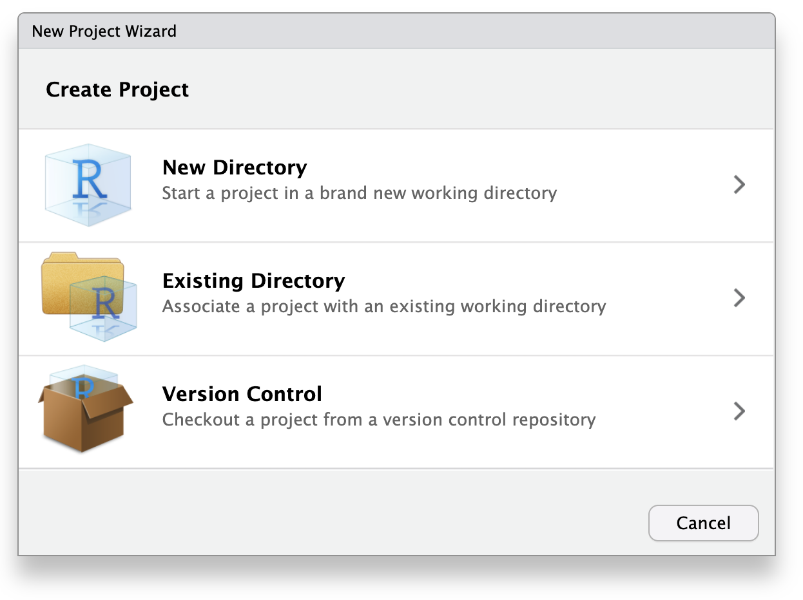
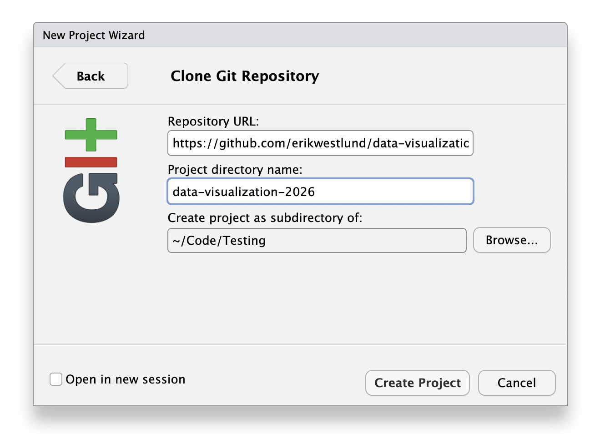

<style>
figcaption,
.figure-caption,
p.caption {
  text-align: center;
  margin-top: 0.25rem;
  margin-bottom: 2rem;
}
</style>

# Goal

This module describes how the course materials are set up in RStudio and how the course folder is organized.

The class walkthrough will move through these steps together.

# Step 1: The Project Menu

{fig-alt="RStudio project menu showing the New Project option."}

The project menu is in the upper-right corner of RStudio.

The **New Project...** option starts the process of creating or opening an RStudio project.

# Step 2: Version Control

{fig-alt="RStudio New Project Wizard with New Directory, Existing Directory, and Version Control options."}

The New Project Wizard includes several ways to create a project. The course repository is copied from GitHub through **Version Control**.

# Step 3: Git

{fig-alt="RStudio New Project Wizard version control screen with Git and Subversion options."}

The **Git** option connects RStudio to a GitHub repository.

# Step 4: Repository And Folder

{fig-alt="RStudio Clone Git Repository screen with repository URL, project directory name, and local folder location fields."}

The course repository address goes in **Repository URL**:

<div style="border: 1px solid #9ca3af; border-radius: 6px; padding: 0.75em 1em; background: #f8fafc; font-size: 1.05em; overflow-wrap: anywhere;">
<a href="https://github.com/erikwestlund/data-visualization-2026"><code>https://github.com/erikwestlund/data-visualization-2026</code></a>
</div>

The local folder location controls where the course materials are saved on the computer.

The **Browse...** button can be used to choose a different folder.

A typical location is a folder used for coursework or projects.

The **Create Project** button starts the clone and opens the course project.

This step requires an internet connection and Git. If **Git** does not appear as an option in RStudio, Git is not installed or RStudio has not found it yet.

# Step 5: Confirm The Project Opened

{fig-alt="RStudio open with the course project loaded, console on the left, environment pane in the upper right, and files pane in the lower right."}

After RStudio opens the project, the window should say `data-visualization-2026` near the top.

RStudio is usually organized into four panes:

- **Source/editor pane:** where notebooks and scripts open. If no file is open yet, this pane may not be visible.
- **Console pane:** where R commands can be typed and run directly.
- **Environment pane:** where R objects appear after code creates them.
- **Files/Plots/Packages/Help/Viewer pane:** where files, plots, packages, help pages, and output previews appear.

The Files pane should show course files and folders such as `modules`, `practice`, `data`, `slides`, `syllabus.html`, and `updater.R`.

# Step 6: The Project

The course folder includes two files that tell the software where the course starts:

- `data-visualization-course.Rproj` for RStudio
- `data-visualization-course.code-workspace` for Positron

These files tell the IDE the base location for the course project.

Once the IDE knows the project root, notebooks can refer to files naturally from one shared base location instead of depending on where each notebook lives in the folder structure.

For example, a notebook can refer to a data file with a path like:

```r
readr::read_csv("data/real/prams_2011_selected.csv")
```

## Assignments

The `assignments/` folder contains rendered HTML instructions for problem sets and the final project.

## Slides

The `slides/` folder contains rendered HTML slide decks for class concepts and transitions.

## Data Directory

The `data/` folder contains the datasets used in modules, practice notebooks, problem sets, and the final project.

The most important file in this folder is:

- [`data/data.html`](../../../data/data.html): the Course Data Summary

In RStudio, this file can be opened from the Files pane by opening the `data/` folder and clicking `data.html`.

Other important pieces are:

- `data/manifest.csv`: a table listing all datasets
- `data/real/`: real public or teaching datasets that have been cleaned for class
- `data/simulated/`: simulated analog datasets with similar structure
- `data/codebooks/`: codebooks describing the files and variables

The Course Data Summary links to each dataset and its codebook.

The codebook includes:

- the unit of analysis
- variable definitions
- whether values are raw observations, summaries, percentages, or estimates
- what cautions apply before interpreting a plot

## Modules

The `modules/` folder contains course-owned notebooks used during class, such as:

- `modules/01-workflow-and-basics/`
- `modules/02_categorical-data/`
- `modules/03_continuous-data/`
- later folders for group comparison, association, change, space, flow, and communication

Most module files end in `.qmd`. These are Quarto notebook source files.

The course may also include rendered HTML versions of module notebooks for quick viewing without running the code.

- `modules/`: course-owned notebooks opened and run during class
- rendered module HTML: finished versions for quick viewing when provided

The `modules/` folder is not for saved student work. Course updates may add, rename, or remove files in `modules/`.

## Practice

The `practice/` folder contains starter notebooks and student work copies.

This folder has two main parts:

- `practice/templates/`: starter notebooks provided with the course
- `practice/work/`: personal copies of practice notebooks

The `practice/work/` folder is the place for edits. The updater copies new templates into `practice/work/` without overwriting files that are already there.

If packages are missing, run `source("install-packages.R")` from the project root once before rendering notebooks.

# Step 7: Test The Updater

This command runs in the R Console from the project root:

```r
source("updater.R")
```

The updater does two things:

- gets the latest instructor-owned course files when the Git version of the course folder is in use
- copies any missing practice templates into `practice/work/`

Instructor-owned course files in folders such as `modules/`, `slides/`, `assignments/`, `data/`, and `practice/templates/` may be added, changed, renamed, or removed when the course updates.

The updater does not overwrite files that already exist in `practice/work/`.

One of these outcomes should appear in the Console:

- Git says the course is already up to date
- Git downloads course updates
- the updater reports that it copied practice templates
- the updater reports that practice templates already exist

After the updater runs, the `practice/work/` folder should contain practice notebooks.

# Next Step

The next class module is:

`modules/01-workflow-and-basics/02_first-visualization.qmd`

We will work through that notebook together.
