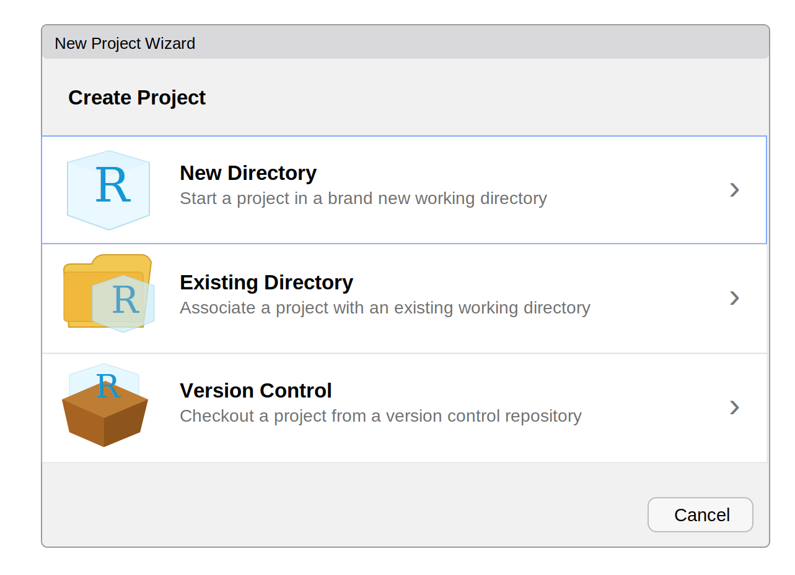

<style>
figcaption,
.figure-caption,
p.caption {
  text-align: center;
  margin-top: 0.25rem;
  margin-bottom: 2rem;
}
</style>

# Goal

This module walks through getting the course materials in RStudio.

We will do this step by step in class. Follow along on your own computer.

# Step 1: Open The Project Menu

{fig-alt="RStudio project menu showing the New Project option."}

In the upper-right corner of RStudio, open the project menu.

Click **New Project...**.

# Step 2: Choose Version Control

{fig-alt="RStudio New Project Wizard with New Directory, Existing Directory, and Version Control options."}

In the New Project Wizard, click **Version Control**.

# Step 3: Choose Git

{fig-alt="RStudio New Project Wizard version control screen with Git and Subversion options."}

Click **Git**.

# Step 4: Enter The Repository And Folder

{fig-alt="RStudio Clone Git Repository screen with repository URL, project directory name, and local folder location fields."}

Paste the course repository address into **Repository URL**:

<div style="border: 1px solid #9ca3af; border-radius: 6px; padding: 0.75em 1em; background: #f8fafc; font-size: 1.05em; overflow-wrap: anywhere;">
<a href="https://github.com/erikwestlund/data-visualization-2026"><code>https://github.com/erikwestlund/data-visualization-2026</code></a>
</div>

Then choose where you want the course materials saved on your computer.

Use **Browse...** if you want to choose a different folder.

Choose a location that does not already contain another copy of this course folder.

Click **Create Project**.

This step requires an internet connection and Git. If **Git** does not appear as an option in RStudio, Git is not installed or RStudio has not found it yet.

# Step 5: Confirm The Project Opened

{fig-alt="RStudio open with the course project loaded, console on the left, environment pane in the upper right, and files pane in the lower right."}

After RStudio opens the project, the window should say `data-visualization-2026` near the top.

RStudio is usually organized into four panes:

- **Source/editor pane:** where notebooks and scripts open. If no file is open yet, this pane may not be visible.
- **Console pane:** where you can type and run R commands directly.
- **Environment pane:** where R objects appear after you create them.
- **Files/Plots/Packages/Help/Viewer pane:** where you browse files, view plots, manage packages, read help pages, and preview output.

In the Files pane, confirm that you can see course files such as `modules`, `practice`, `data`, `slides`, `syllabus.html`, and `updater.R`.

# Step 6: The Project

The course folder includes two files that tell your software where the course starts:

- `data-visualization-course.Rproj` for RStudio
- `data-visualization-course.code-workspace` for Positron

These files tell the IDE the base location for the course project.

That matters because the course has many folders: `assignments`, `slides`, `data`, `modules`, and `practice`.

Once the IDE knows the project root, we can refer to files naturally from one shared base location instead of constantly worrying about where each notebook lives in the folder structure.

For example, a notebook can refer to a data file with a path like:

```r
readr::read_csv("data/real/prams_2011_selected.csv")
```

## Assignments

Open the `assignments/` folder in the Files pane.

This folder contains rendered HTML instructions for problem sets and the final project.

## Slides

Open the `slides/` folder in the Files pane.

This folder contains rendered HTML slide decks for class concepts and transitions.

## Data Directory

Open the `data/` folder in the Files pane.

This folder contains the datasets we will use in modules, practice notebooks, problem sets, and the final project.

The most important file to open first is:

- [`data/data.html`](data/data.html): the Course Data Summary

You can find it in the Files pane by opening the `data/` folder and clicking `data.html`.

Other important pieces are:

- `data/manifest.csv`: a table listing all datasets
- `data/real/`: real public or teaching datasets that have been cleaned for class
- `data/simulated/`: simulated analog datasets with similar structure
- `data/codebooks/`: codebooks describing the files and variables

The Course Data Summary links to each dataset and its codebook.

The codebook is where you check:

- what one row represents
- what each variable means
- whether values are raw observations, summaries, percentages, or estimates
- what cautions apply before interpreting a plot

## Modules

Open the `modules/` folder in the Files pane.

Modules are the notebooks we will use during class. I will often open a module, make the text large, talk through the setup, run code chunks step by step, and show the output as we go.

The `modules/` folder contains the editable notebook files:

- `modules/01-workflow-and-basics/`
- `modules/02_categorical-data/`
- `modules/03_continuous-data/`
- later folders for group comparison, association, change, space, flow, and communication

Most module files end in `.qmd`. These are Quarto notebook source files.

The course also includes `modules/rendered/`, a folder with HTML versions of module notebooks. Use those when you want to quickly view a finished version without running the code yourself.

- `modules/`: notebooks we can open, run, and edit during class
- `modules/rendered/`: HTML versions for quick viewing

## Practice

Open the `practice/` folder in the Files pane.

This folder has two parts:

- `practice/templates/`: starter notebooks provided with the course
- `practice/work/`: your own copies of practice notebooks

Use `practice/work/` for your edits. The updater copies new templates into `practice/work/` without overwriting files that are already there.

# Step 7: Test The Updater

Run this command in the R Console from the project root:

```r
source("updater.R")
```

The updater does two things:

- gets the latest course files if you are using the Git version of the course folder
- copies any missing practice templates into `practice/work/`

It does not overwrite files that already exist in `practice/work/`.

You should see one of these outcomes in the Console:

- Git says the course is already up to date
- Git downloads course updates
- the updater reports that it copied practice templates
- the updater reports that practice templates already exist

After it runs, open `practice/work/` in the Files pane. You should see practice notebooks there.

# Next Step

Open the first visualization module:

`modules/01-workflow-and-basics/02_first-visualization.qmd`

We will work through that notebook together.
