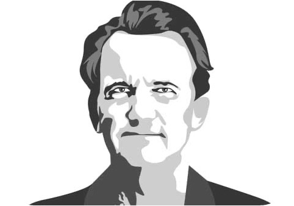
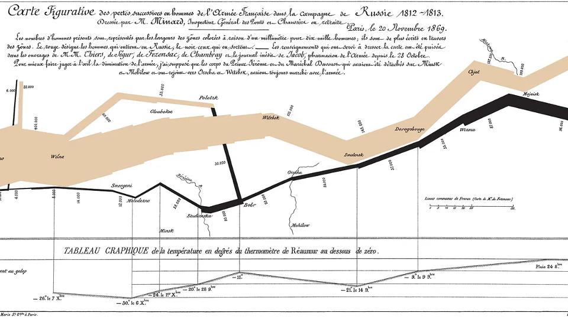
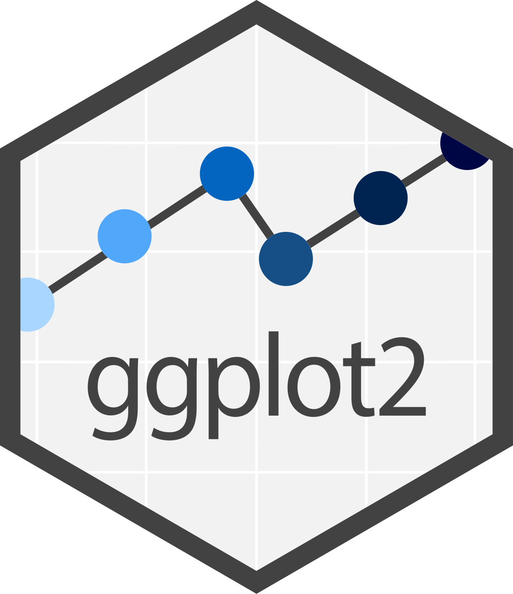
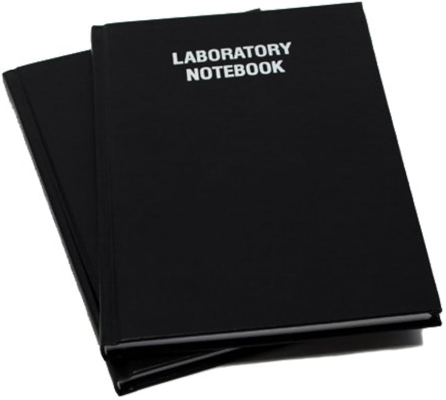

# Welcome

## Today's Goals

1. Open the course project, run `source("updater.R")`, and render a notebook.
2. Use grammar-of-graphics vocabulary to build and read a first `ggplot2` plot.

## What This Course Is About

Data visualization has two primary purposes:

- understanding data
- communicating

## Visualization As An Analytic Tool

Visualization is not an add-on after the real analysis is done, but a crucial part of understanding data:

- structure
- variation
- patterns
- anomalies
- relationships

## Visualization As A Communicative Tool

- Visualization also helps us explain what we have learned.
- It lets us communicate scientific arguments, evidence, uncertainty, and limitations.

## These Goals Overlap

- Understanding and communication are not completely separable.
- The same figure can help us discover a pattern, refine our thinking, and explain the result to someone else.

## Visualization Is Iterative

Good visualization usually moves in cycles:

- ask a question
- prepare the data
- make a plot
- interpret what we see
- revise the plot
- share or revise the result for an audience

You can see how understanding and communication are built into this cycle.

# Substance, Statistics, & Design

## Tufte on Graphical Excellence

::: {.columns}
::: {.column width="45%"}

:::

::: {.column width="55%"}
> "Graphical excellence is the well-designed presentation of interesting data - a matter of substance, of statistics, and of design..."

*Edward Tufte, The Visual Display of Quantitative Information, 1983*
:::
:::

## Substance, Statistics, & Design

- Like how understanding and communicating are not easily separable, neither are substance, statistics, or design. 
- Good design, for example, aids communication
- Poor design of a graphic hinders understanding.

## Minard's Napoleon March



## For The Rest Of Us

Tufte's examples are extraordinary, but most of our work is more routine.

::: {.incremental}
- Choose the right format for the question.
- Use words, numbers, and drawing together.
- Show enough complexity to be useful.
- Avoid decoration that does not help the argument.
:::

# Core Topics

## Core Visualization Questions

::: {.incremental}
- **Counts**: how many are in each category?
- **Rank**: what is higher or lower?
- **Center**: what is typical?
- **Spread**: how much variation is there?
- **Shape**: what does the distribution look like?
- **Outliers and anomalies**: what is unusual?
:::

## Core Visualization Questions

::: {.incremental}
- **Composition**: what is the whole made of?
- **Grouping**: how do patterns differ across categories?
- **Association**: how do variables move together?
- **Change**: how do patterns move over time or order?
- **Space**: where do patterns occur?
- **Flow**: how do entities, such as people or decisions, move through stages?
:::

## Data Visualization & Science

Lets pause and go back to the above list.

What type of real-world scientific questions/topics might these visualizations help us understand or answer?

::: {.incremental}
- **Counts**: how many are in each category?
- **Rank**: what is higher or lower?
- **Center**: what is typical?
- **Spread**: how much variation is there?
- **Shape**: what does the distribution look like?
- **Outliers and anomalies**: what is unusual?
:::

## Data Visualization & Science (cont.)

::: {.incremental}
- **Composition**: what is the whole made of?
- **Grouping**: how do patterns differ across categories?
- **Association**: how do variables move together?
- **Change**: how do patterns move over time or order?
- **Space**: where do patterns occur?
- **Flow**: how do entities, such as people or decisions, move through stages?
:::

## Today

::: {.incremental}
- course workflow
- `ggplot2` basics
- transformations and aggregations
- first plots
:::

## Preview: Day 2

::: {.incremental}
- data manipulation required for data visualizatoin
- basic plots: counts, summaries, ordering, and rank
- one-variable exploratory data analysis
- center, spread, distribution shape, and unusual values
:::

## Preview: Day 3

::: {.incremental}
- **group comparison**: distributions and summaries across groups
- **composition**: denominators, proportions, and part-to-whole comparisons
- **association**: how variables move together
- interaction as association plus grouping
:::

## Preview: Day 4

::: {.incremental}
- **change**: time, order, and trajectories
- **space**: maps, spatial comparison, and non-map alternatives
- **flow**: process diagrams and movement through stages
:::

## Preview: Day 5

::: {.incremental}
- communication and critique
- polish, annotation, and accessibility
- interpretation and final project studio
:::


## Course Timing

- This is a live short course, so I may adjust timing and examples as we go.
- I will announce any material changes in class.

# Tools

## Tools We Will Use

::: {.columns}
::: {.column width="25%"}

:::
::: {.column width="25%"}

:::
::: {.column width="25%"}

:::
::: {.column width="25%"}

:::
:::

## R

R is the programming language we use to work with data.

In this course, R is where we will:

- load data
- clean and transform variables
- summarize rows into useful tables
- create plots
- save or render results

## RStudio Or Positron

RStudio and Positron are applications for working with R projects.

They give us a place to keep together:

- scripts and notebooks
- data files
- plots and rendered outputs
- the R console
- project folders

I will use RStudio in this course, but Positron is fine for advanced users (I use it in my daily work)

## Quarto

Quarto is the notebook and report system we will use.

A Quarto notebook lets us combine:

- explanation
- code
- output
- figures
- interpretation

The rendered HTML file is what you can submit or share.

## ggplot2

`ggplot2` is the R package we will use to make most visualizations.

Instead of choosing a chart from a menu, we build figures from parts:

- data
- aesthetic mappings
- geometric marks
- summaries or transformations
- labels, scales, and themes


# Scientific Notebooks

## Scientific Notebooks

::: {.columns}


::: {.column width="65%"}
Scientific notebooks let us keep together:

- narrative text
- code
- output
- figures
- interpretation

:::

::: {.column width="35%"}

:::

:::

Visualization is a process, not just a final image.

## Quarto

- Quarto is one example of a scientific notebook system
- Others include Rmarkdown (which influenced Quarto) or Jupyter notebooks (popular with Python users)
- We will focus on Quarto going forward

## Parts Of A Quarto Notebook

A `.qmd` file usually has four parts:

- a YAML header
- Markdown text
- code chunks
- rendered output

You edit the first three. Quarto creates the fourth.

## YAML Header

The YAML header is the document settings block at the top.

```yaml
---
title: "First Visualization"
format:
  html:
    embed-resources: true
    toc: true
---
```

This tells Quarto what kind of file to make and how to format it.

## Project-Level Quarto Settings

This course folder also uses `_quarto.yml` files.

Those files hold shared settings that apply to many notebooks at once.

For example, `_quarto.yml` can set HTML output options such as:

- table of contents
- syntax highlighting
- self-contained HTML files

That keeps us from repeating the same settings in every notebook.

## Markdown Text

Markdown is ordinary writing with light formatting.

```markdown
# Load Data

Each row is one state/subgroup estimate.

- What does the variable measure?
- What does one point represent?
```

Use Markdown for questions, interpretation, notes, and reminders to yourself.

## Code Chunks

R code lives inside code chunks.

In the notebook, a chunk starts with ```` ```{r} ```` and ends with ```` ``` ````.

```{r}
#| eval: false
library(dplyr)
library(ggplot2)

mtcars |>
  summarize(avg_mpg = mean(mpg))
```

Chunks are where the notebook does work: loading data, transforming data, making tables, and drawing plots.

## The Setup Block

- The setup block is usually near the top and loads what the notebook needs.

```r
library(dplyr)
library(ggplot2)
library(readr)
```

If a package is used later, it should by convention be loaded here.

## Render Early & Often

- Running one chunk checks one piece.
- Rendering checks the whole notebook from a clean start.
- Rendering frequently catches problems like:

  - chunks run out of order
  - objects that exist only in your Console
  - missing packages
  - file paths that only work on your computer

## When Render Fails

- Read the first error, not the last page of output.
- Usually the fix is one of these:

  - run or fix the setup chunk
  - create the object before using it
  - load the needed package
  - check the file path

Then render again.

## Self-Contained HTML

- Our default setup uses self-contained HTML files. This bundles all images and other resources in one file so they are easily shared.
- This makes the file easier to upload, email, archive, and grade.

## Good Notebook Habits

For most course work, use this loop:

- make a small edit
- run the relevant chunk
- write down what changed
- render the entire notebook before moving on

Do not wait until the end to find out the notebook cannot render.


# AI, LLMs, And Data Visualization

## AI And Data Visualization

- AI and LLMs are becoming more and more powerful
- They can help you with many data-related tasks, but require care
- They are allowed in this course, but you are responsible for checking their work

## My Philosophy

- I use LLMs now in many aspects of my work
- LLMs can often help with syntax, but syntax is not the whole task.
- You still need to define the question, choose an appropriate plot, and check whether the output is honest.
- In this course, we will use code to learn visualization judgment, not just to make software produce an image.

# Grammar Of Graphics

## Grammar Of Graphics

- The grammar of graphics is a set of rules for how visual representations of data are structured.
- Like grammar in language, it gives us parts and relationships.
- It lets us describe a figure without starting from chart names.

## Grammar Versus Chart Names

- When you only think in chart types, you ask: "Should I make a bar chart or a scatterplot?"
- When you think in grammar, you ask: "What data do I have, what comparison do I need, and how should variables become visual features?"

## Being Honest

- I still think in chart types and I think most people do.  
- It turns out that the grammar of graphics provides us a powerful foundation to build the charts we want to build
- As an added benefit, the concepts can add clarity to our thinking about what we're doing.


## The `gg` Workflow

::: {.incremental}
1. Start with data.
2. Pick an aesthetic mapping.
3. Choose a geometric object.
4. Add statistical transformations.
5. Adjust finer details: scales, coordinate systems, faceting, etc.
:::

This is the conceptual workflow, whereas `ggplot2` in R is an implementation of it.

## Start With Data

Before plotting, think about the level of observation.

- what does one observation represent?
- are observations people, places, events, months, or summaries?
- are values raw measurements, counts, percentages, or model estimates?

## Data Manipulation Is Fundamental

Most visualization work starts by shaping the data:

- selecting variables
- filtering to the right observations
- counting categories
- summarizing values by group
- creating variables that match the question

Today we will do this lightly. On Day 2 we will dedicate a lot of time to this, as it is truly a prerequisite for good data visualization and good data analysis in general.

Day 2 starts with easy wins: counts, summaries, and ordering. Then we use the same data habits to study one variable at a time.

## Aesthetic Mappings

- An aesthetic mapping connects a variable to something visible.
- It sounds highfalutin, but it really captures:

  - what is on x?
  - what is on y?
  - what, if anything, uses color, size, shape, line type, or fill?

Mappings are claims about what the reader should compare.


## Geometric Objects ("geoms")

* Geoms are the elements used to represent the data
* Geoms have associated stats/functions/statistical transformations 
* Stats such as counts for groups often involve aggregations

## Geoms (cont.)

<table>
<thead>
<tr>
<th>Geom</th>
<th>R Function</th>
<th>Stat/Transform</th>
<th>Use for</th>
</tr>
</thead>
<tbody>
<tr class="fragment">
<td>Point</td>
<td><code>geom_point()</code></td>
<td>Identity</td>
<td>Scatter plots</td>
</tr>
<tr class="fragment">
<td>Bar</td>
<td><code>geom_bar()</code></td>
<td>Count</td>
<td>Bar plots</td>
</tr>
<tr class="fragment">
<td>Line</td>
<td><code>geom_line()</code></td>
<td>Identity</td>
<td>Line plots</td>
</tr>
<tr class="fragment">
<td>AB Line</td>
<td><code>geom_abline()</code></td>
<td>Slope/intercept</td>
<td>Reference lines</td>
</tr>
<tr class="fragment">
<td>Horizontal line</td>
<td><code>geom_hline()</code></td>
<td>Y intercept</td>
<td>Reference lines</td>
</tr>
<tr class="fragment">
<td>Vertical line</td>
<td><code>geom_vline()</code></td>
<td>X intercept</td>
<td>Reference lines</td>
</tr>
<tr class="fragment">
<td>Smoother</td>
<td><code>geom_smooth()</code></td>
<td>Smoothing function (GAM, Loess, etc.)</td>
<td>Showing patterns/trends</td>
</tr>
</tbody>
</table>


## Position/Fill

- You can use position/fill to move elements around and color code geoms by aspects of the data, such as categories.
- For example, with a bar chart:

    - `stack`: Stack bars on top of each other 
    - `fill`: Stack bars, but make them always fill up vertical space to 1
    - `dodge`: Put the bars next to each other

We will return to these choices later. Day 2 will first emphasize position on a common scale, because that is usually the easiest visual comparison for readers.

## Consider Faceting

When you reach for fill, always consider faceting in small multiples.

- the brain struggles with many fills
- facets repeat the same plot across groups
- repeated panels often make group patterns easier to compare

## Aggregations

- For row counts, `geom_bar()` can count observations inside `ggplot2`.
- For pre-summarized values, use `geom_col()` or `geom_bar(stat = "identity")`.
- A good workflow is to summarize first, then plot the summary.

## Aggregation (example logic)

Many visualizations summarize rows into groups.

```r
cars |>
  group_by(make) |>
  summarize(avg_mpg = mean(mpg))
```
This example shows the logic of grouping and transforming to get a single value we might plot with a bar chart.

## Aggregation Complexity

- Automatic `ggplot2` summaries are useful for simple cases.
- For trickier summaries, calculate the table yourself and plot the result with `geom_col()`, points, or another geom that uses the values already in the data.
- This separates the statistical logic from the visual logic and often makes a tricky figure easier to make.

## Scales And Coordinates

Scales and coordinate systems control finer details of the figure.

Common decisions:

- axis limits and breaks
- category order
- flipped axes
- linear or transformed scales
- geographic or standard coordinates

## Labels And Theme

Labels and theme are part of the final adjustment step.

- labels state variables, units, and context
- titles can frame the question or main pattern
- themes control clutter and emphasis
- guides help the reader decode mappings

## `ggplot2` As Implementation

In this course, `ggplot2` is the R tool we use to implement the grammar.

```r
ggplot(data, aes(x = variable_1, y = variable_2)) +
  geom_something()
```

Read this conceptually:

- start with data
- map variables to visual features
- draw a geometric object

## Functions

R work is mostly function calls.

```r
function_name(argument_1, argument_2)
```

Examples:

- `mean(mpg)`
- `count(cars, make)`
- `ggplot(cars, aes(x = mpg))`

## Plot Objects

In R, we can save a plot as an object.

```r
p1 <- ggplot(cars, aes(x = mpg)) +
  geom_histogram()

p1
```

The first line creates the object.

The second line prints it.

## Building Plots Step By Step

In this course, we will often build plots as `p1`, `p2`, `p3`, and so on.

```r
p1 <- ggplot(cars, aes(x = mpg)) +
  geom_histogram()

p2 <- p1 +
  labs(title = "Distribution of fuel efficiency")
```

This lets us see what each change does.

It also makes it easier to go back if a later version gets worse.


# Course Workflow

## Course Workflow

We will use three kinds of materials:

- slides for concepts and transitions
- module notebooks for complete examples
- practice notebooks for your work

## Course Information

- The [course website](https://erik-westlund.academic.page/courses/data-visualization) has key documents (these are also reproduced on CoursePlus)
- This repository will be updated during the week.
- We will use Git and GitHub to pull down new files, but you do not need to become a Git expert.


## The Daily Update Command

Each day, run this from the R Console at the project root:

```r
source("updater.R")
```

This pulls course updates and copies new practice templates into your work folder.

(We do this instead of just fetching new code because of how .gitignore works with your personal work.)

## Instruction Materials

Instructor-owned materials may be updated during the course:

- `modules/`
- `practice/`
- `slides/`
- `assignments/`
- `data/`

## Student Work

- Your work belongs in: `practice/work/`
- This directory is ignored by Git.

That means:

- course updates should not overwrite your work
- rendered files should not interfere with updates
- you can keep editing your copies while new templates arrive

## Module Notebooks

Every example figure has its own Quarto notebook in `modules/`.

These are complete instructor/reference examples, such as:

- `modules/00_preclass-tech-check/02_setup-check.qmd`
- `modules/01-workflow-and-basics/01_course-materials.qmd`
- `modules/01-workflow-and-basics/02_first-visualization.qmd`

Use module notebooks when you want to see a complete version of the idea.

## Practice Notebooks

You will also have in-class and homework practice notebooks.

These follow the same basic format as the module notebooks, but they leave more for you to complete:

- `practice/01-workflow-and-basics/01_explore-and-visualize.qmd`

Use `source("updater.R")` to copy templates into `practice/work/`.

Edit the copies in `practice/work/`, not the templates.

# Practice

## Class Activities

- Everyone has RStudio running
- Everyone has the repository cloned
- Everyone can run `source("updater.R")`
- Everyone can render a notebook
- First visualization
